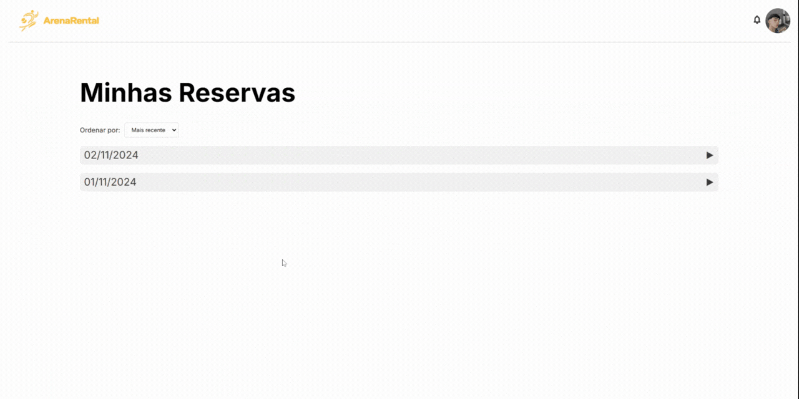

# ArenaRental 🏀
    </br>
Uma plataforma completa para aluguel de quadras esportivas, conectando atletas a espaços esportivos de maneira simples e eficiente.


**Nossa plataforma é uma solução inovadora para o aluguel de quadras esportivas e a gestão desses estabelecimentos.**

De um lado, oferecemos aos clientes uma forma simples e rápida de encontrar e reservar quadras próximas para praticar esportes.
Visualização de horários disponíveis em tempo real, sem necessidade de ligações ou visitas presenciais.
**Processo rápido, acessível, e intuitivo.**

Do outro, ajudamos os donos de estabelecimentos a gerenciar suas quadras de maneira eficiente, otimizando o uso e aumentando a visibilidade.
**Ferramentas de gerenciamento que aumentam a eficiência e reduzem o tempo gasto com controle manual.**
Notificações em tempo real sobre novas reservas e cancelamentos.

### Funcionalidades Principais⚽
#### 🔍 Busca avançada de quadras por:
  - Regiões de Belo Horizonte
  - Modalidades esportivas
  - Preço


 
#### 📱 Gestão de Reservas
  - Agendamento em tempo real
  - Visualização de horários disponíveis
  - Histórico de reservas
  - Cancelamento de reservas


 
#### 💬 Bate-papo ao-vivo:
  - Mensagens em tempo real entre clientes e propriétarios
  - Envio de textos, imagens e vídeos


- 📅 Notificações em tempo real
  - Quando o **propretário** confirma ou cancela o horário
  - Quando um **cliente** reserva um horário   


## Tecnologias Utilizadas 🛠️
<div align="left">
  
  
  
  
  
</div>

## 🚀 Como Executar o Projeto

### Pré-requisitos

Antes de começar, você vai precisar ter instalado em sua máquina as seguintes ferramentas:
* [WampServer](http://www.wampserver.com/en/) (Apache, MySQL, PHP)
* [Git](https://git-scm.com)
* Um navegador moderno

### 🎲 Rodando o Projeto

```bash
# Clone este repositório
$ git clone https://github.com/lucaspanzera1/ArenaRental.git

# Acesse a pasta do projeto
$ cd arenarental

# Copie os arquivos para a pasta www do WampServer
# Geralmente localizada em: C:\wamp64\www\

# Inicie o WampServer
# O ícone deve ficar verde na barra de tarefas

# Importe o banco de dados
# Acesse: http://localhost/phpmyadmin
# Crie um novo banco de dados chamado 'arenarental'
# Importe o arquivo 'database.sql' localizado na pasta 'config'

# Configure a conexão com o banco
# Abra o arquivo 'config.php' e configure suas credenciais MySQL
$host = "localhost"
$dbname = "arenarental"
$username = 'root'
$password = ''

# Acesse o projeto
$ http://localhost/arenarental
```
### 🗺️ Configurando a API do Google Maps
```bash

Para utilizar as funcionalidades de mapas, você precisará de uma chave API do Google Maps.
Siga os passos:

1. Acesse o Google Cloud Console
  Vá para [Google Cloud Console](https://console.cloud.google.com/)
  Crie uma conta ou faça login se já tiver

2. Crie um Projeto
    Clique em "Criar Projeto"
    Dê um nome ao projeto (ex: "ArenaRental")
    Clique em "Criar"

3. Ative as APIs Necessárias
    No menu lateral, vá em "APIs e Serviços" > "Biblioteca"
    Procure e ative a seguinte API:
      Maps JavaScript API

4. Obtenha sua Chave de API
    No menu lateral, vá em "APIs e Serviços" > "Credenciais"
    Clique em "Criar Credenciais" > "Chave de API"
    Sua chave será gerada (formato: AIzaSyB...)

5. Restrinja sua Chave de API (Recomendado)
    Nas configurações da chave, adicione restrições:
      Restrição de HTTP: Adicione seu domínio
      Restrição de APIs: Selecione apenas as APIs que você ativou

6. Configure no Projeto
    Abra o arquivo `ArenaRental/views/home/quadra_detalhes.php`
    Procure a variável de configuração da API
    Adicione sua chave:
<script src="https://maps.googleapis.com/maps/api/js?SUA-CHAVE-AQUI&callback=initMap" async defer></script>
```

## 📁 Estrutura do Projeto

```plaintext
arenarental/
├── api/
│   ├── check_notifications.php
│   ├── enviar_mensagem.php
│   ├── get_conversas.php
│   ├── get_mensagens.php
│   ├── getHorariosData.php
│   ├── getReservasTotais.php
│   ├── getReservasUsuarioData.php
│   ├── getWeeklyData.php
│   ├── marcar_como_lida.php
│   └── mark_notification_read.php
├── config/
│   ├── dados_base/
│   │   ├── conexao.php
│   │   └── database.sql
├── controllers/
│   ├── AuthController.php
│   ├── ClientController.php
│   ├── HomeController.php
│   └── OwnerController.php
├── models/
│   ├── Chat.php
│   ├── Client.php
│   ├── Conexao.php
│   ├── Notification.php
│   ├── Owner.php
│   └── User.php
├── resources/
│   ├── css/
│   ├── images/
│   └── js/
├── upload/
│   ├── chat/
│   ├── propriedade/
│   ├── quadra_img/
│   └── user_pfp/
├── views/
│   ├── auth/
│   ├── client/
│   ├── home/
│   ├── layouts/
│   ├── owner/
│   └── index.php
└── README.md
```
### 📂 Descrição das Pastas
- api/ - Esta pasta contém scripts PHP que servem como a "API" do sistema. São responsáveis por realizar operações específicas e fornecer dados para o frontend ou outras partes do sistema
- config/ - Contém arquivos de configuração essenciais para o funcionamento do sistema, especialmente relacionados ao banco de dados.
- controllers/ - Esta pasta armazena os controladores do projeto, que contêm a lógica de negócios da aplicação. Cada controlador é responsável por uma parte específica do sistema.
- models/ - Contém os modelos da aplicação, que representam as entidades do banco de dados e centralizam operações de dados. Eles são usados para interagir com o banco de dados e manipular informações de maneira organizada.
- resources/ - Esta pasta armazena arquivos estáticos e de estilo, como CSS, JavaScript e imagens, que são utilizados para o frontend da aplicação.
- upload/ - Diretório onde são armazenados arquivos enviados pelos usuários. É organizado em subpastas para diferentes tipos de conteúdo.
- views/ - Contém as páginas de visualização do sistema, que são apresentadas ao usuário. Essas páginas geralmente utilizam HTML e são complementadas com CSS e JavaScript para exibir dados dinamicamente e oferecer uma interface amigável. Separados por contexto.

### 📈 Diagrama de Classes


### 📈 Casos de Uso


## ✅ Features
### 👥 Área do Usuário
  * Filtro:
    * 🗺️ Região de Belo Horizonte, Minas Gerais
    * 🏀 Esporte
    * 💲 Valor   
  * 🗺️ Mapa com PIN´s nas quadras disponíveis
  * 👤 Login
  * 📝 Registrar
  * 📅 Ver quadras disponíveis
  * 📅 Ver horários disponíveis
  * 💲 Valores por hora de quadra
  * ℹ️ Informações do espaço e quadra
  * ℹ️ Informações do propretário
  * 🌎 Google Maps interativo com a localização da quadra

### 🏃 Área do Cliente
  * ⚡ Realizar reserva
  * 🏃‍♂️ Acessar perfil
  * 👨‍💻 Editar informações pessoais
  * 🔑 Alterar senha (HASH)
  * 📋 Histórico de reservas
  * ❌ Cancelar reservas
  * ❌ Desativar conta
  * 📨 Notificações
  * ⭐ Sistema de avaliações
  * 💬 Bate-papo

### 👨‍💼 Área do Proprietário
* ✅ Cadastro de quadras com:
   * 📍 Localização via Google Maps
   * 📸 Upload múltiplo de fotos
   * 💰 Definição de preços
   * ⏰ Configuração de horários disponíveis
   * 📝 Descrição detalhada
   * 🏷️ Categorização por esporte
* ⌚ Gerenciador de reservas com:
   * ✅ Confirmar reserva
   * ❌ Cancelar reserva
   * 🏃 Reservar horário por fora
   * ⏰ Adicionar intervalo 
 * 📊 Visão geral das quadras
 * ✍ Editar informações das quadras
 * 📅 Calendário de reservas interativo
 * 📨 Sistema de notificações
 * 📈 Gráfico estatísticos para proprietários

## 📹Sprints
> Sprint 1 - https://youtu.be/W2-_OW83bh0 </br>
> Sprint 2 - https://youtu.be/DTZpjt5lZDo </br>
> Sprint 3 - https://youtu.be/xgdpwfRU22Q </br>
> Sprint 4 - https://youtu.be/EkpY1bn_Ltw </br>
> Sprint 5 - https://youtu.be/GApIXNh9m68 </br>
> Sprint 6 - https://youtu.be/bgj7OaSobtg </br>
> Sprint 7 - https://youtu.be/ZmeHXNwDYo4 </br>
> Sprint 8 - https://youtu.be/u5uU4xC3soE </br>
> Sprint 9 - https://youtu.be/obFrv0XRu0Y?si=3XJ5fOBEHRsfUUzI </br>
> Sprint 10 - https://youtu.be/Ei_lKgFnfaE

# Sobre mim 👋
Desenvolvedor em início de carreira.

- [LinkedIn](https://www.linkedin.com/in/lucas-panzera/)
- [GitHub](https://github.com/lucaspanzera1)
- Contato: lucassouzapanzera@gmail.com
